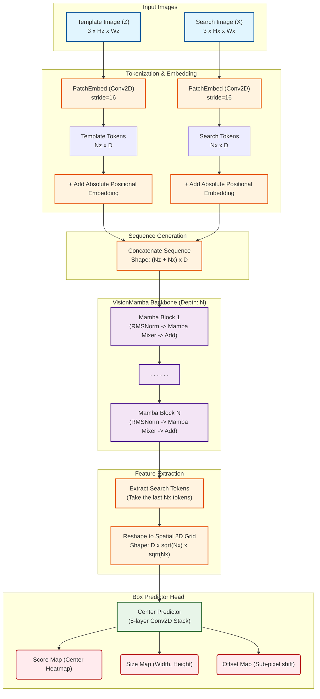

# TrackingMamba Architecture Graph

The following Mermaid graph visualizes the end-to-end forward pass of the `TrackingMamba` model, from the raw template and search images down to the final bounding box heatmap and size predictions.

## Architecture Details

1. **Tokenization:** Uses standard Patch Embedding (like ViT) to map spatial patches to continuous vectors of size `D` (e.g. 192). Positional encodings ensure the model understands where patches came from.
2. **Concatenation:** Crucially, the template tokens are prepended to the search tokens. Because the SSM is unidirectional, this ensures that the state encapsulates the appearance of the template target *before* scanning the search image.
3. **Mamba Backbone:** The sequence flows through stacked Mamba blocks where local contexts and long-range dependencies are integrated efficiently using parallel hardware scans.
4. **Reshaping:** Once sequence processing is complete, only the tokens corresponding to the search area are retained and folded back into a 2D spatial feature map.
5. **Box Head:** A parallelized convolutional head acts on the 2D feature map to predict the heatmaps from which the final bounding box coordinates are derived.
